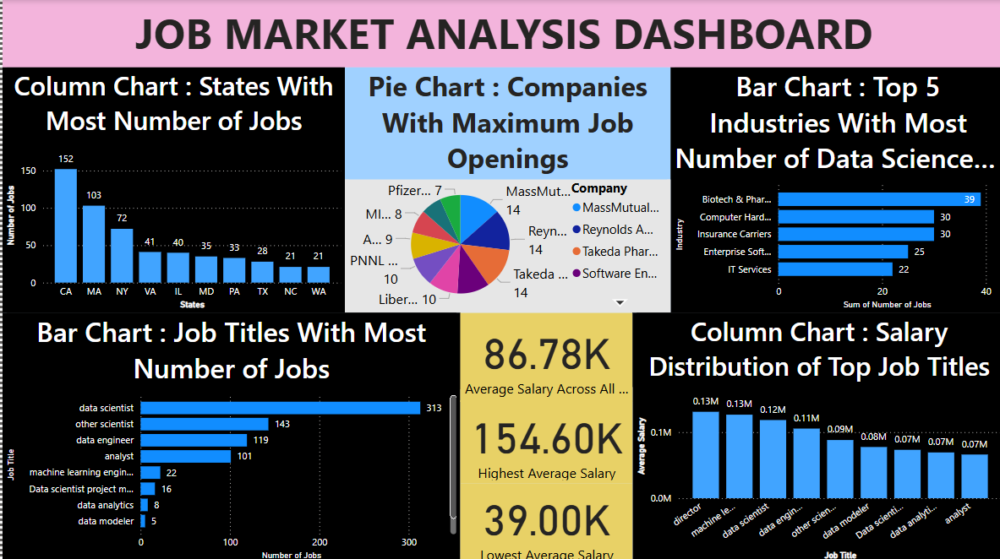

# Job Market Analysis using SQL & Power BI

This project analyzes job market trends such as job roles, required skills, and hiring locations using SQL for data manipulation and Power BI for visualization.

## 📊 Tools Used
- SQL (MySQL)
- Power BI
- Excel (for cleaning)

## 📁 Files Included
- `job_market_queries.sql`: All SQL queries used for extracting and aggregating data
- `job_market_dashboard.pbix`: Power BI report with visualizations and filters
- `job_market_dataset.csv`: Dataset used for analysis
- `job_market_analysis_summary.pptx`: Power Point presentation summarizing the data analysis process and key findings
- `screenshots/`: Dashboard screenshots for quick preview

## 🔍 Key Insights
- Top in-demand job roles 
- Most frequently required skills
- City-wise and company-wise hiring patterns
- State-wise difference in salary for various roles

## 📸 Sample Dashboard

## 🚀 How to Run
1. Open the `.sql` file in MySQL or your DB tool and run the queries.
2. Load the `.pbix` file in Power BI Desktop.
3. Connect to the CSV if dynamic data is used.

## ✨ Author
Abin Abraham  
[LinkedIn](https://www.linkedin.com/in/abin-abraham-83b466242/)
